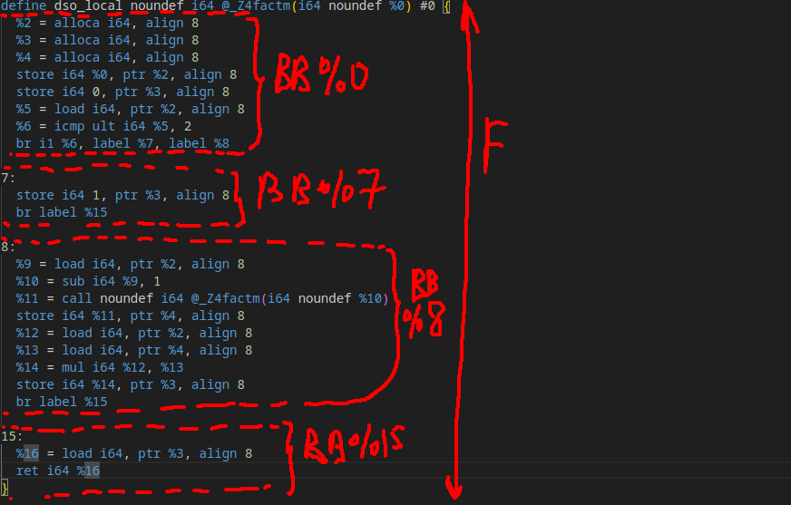
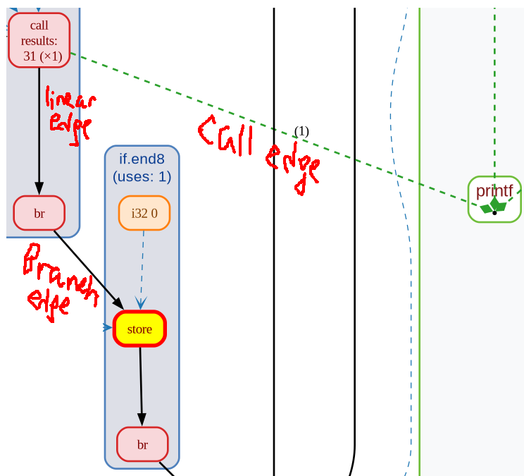
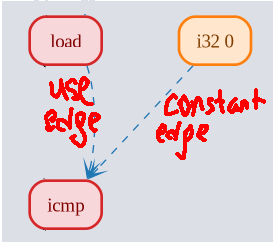
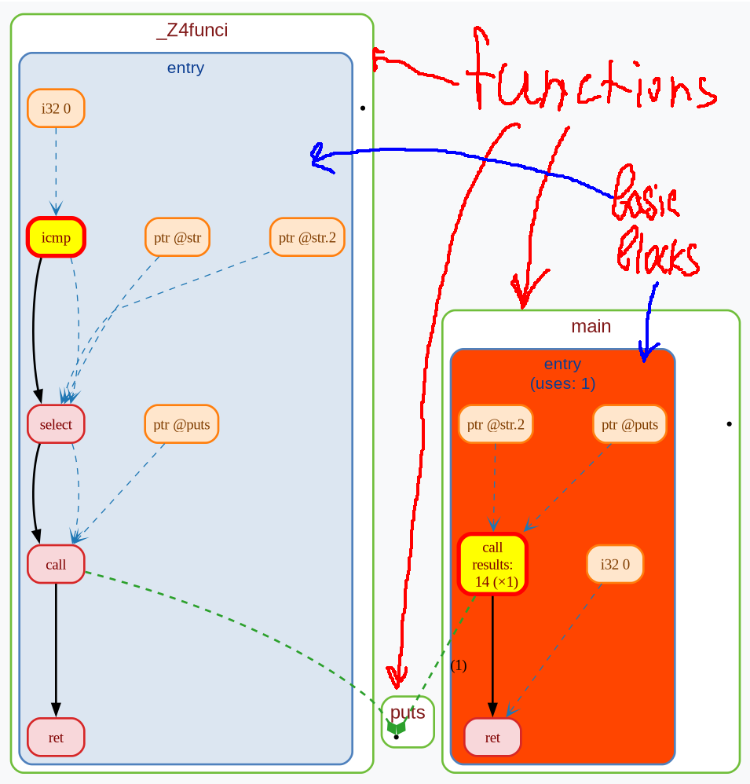
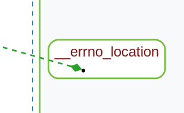
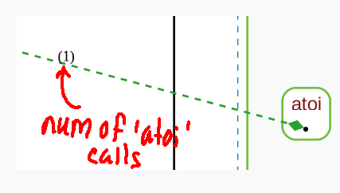
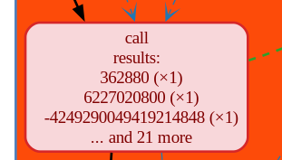
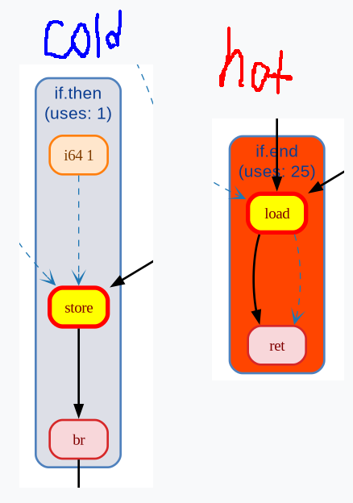
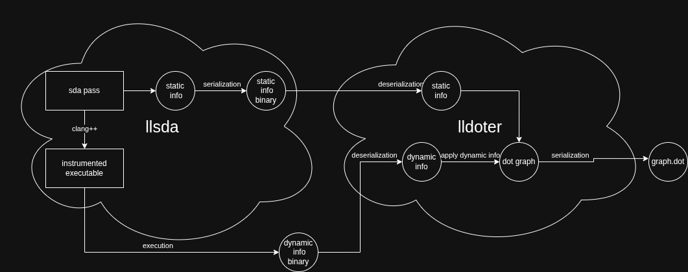
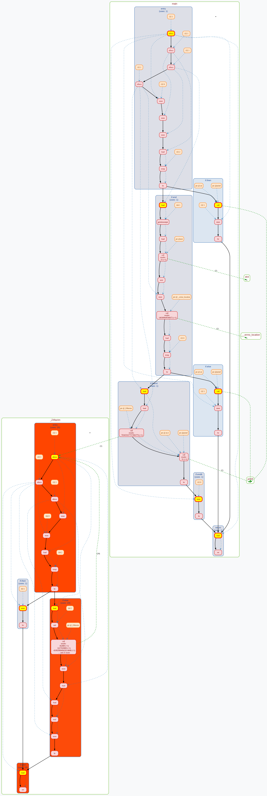

## **LLVM-SDA: Static & Dynamic Analysis Framework**

This repository provides a toolkit for C++ program analysis using LLVM. It allows you to extract the program flow/data graph and overlay it with real-world runtime execution data.

### **Core Utilities**

1.  **`llsda` (LLVM Static and Dynamic Analysis)**: A compiler wrapper that instruments your code. It generates a static representation of the program and prepares the binary to log dynamic behavior during execution.
2.  **`lldoter` (LLVM Data-Objective Trace Extractor & Renderer)**: A post-processing tool that merges the static data (control/data flow) with dynamic traces (basic block frequencies, call arguments, and execution paths) into a `.dot` format.

---

### **Quick Start**

1.  **Clone the repository:**
    ```bash
    git clone https://github.com/I1Va/llvm_visualizer_pass
    cd llvm_visualizer_pass
    ```
2.  **Build the project:**
    ```bash
    ./build.sh
    ```
3.  **Instrument your source code:**
    ```bash
    # This generates 'fact.out' and 'static_info.bin'
    ./llsda/llsda -i c_examples/fact.cpp
    ```
4.  **Execute the instrumented binary:**
    ```bash
    # This generates 'dynamic_info.bin'
    ./fact.out 25
    ```
5.  **Generate the visual graph:**
    ```bash
    ./lldoter/build/lldoter static_info.bin dynamic_info.bin graph.dot
    ```
6.  **Visualize:**
    ```bash
    xdot ./graph.dot
    ```

---

### **How `llsda` Works**

Under the hood, `llsda` builds a dynamic library containing a custom LLVM Pass. This library is injected into the **Clang** optimization pipeline via the `-fpass-plugin` infrastructure. 

Because it hooks into the **New Pass Manager**, the instrumentation occurs at the IR (Intermediate Representation) level, allowing the tool to capture more information than, from a binary level.

---

### **LLVM SDA Pass: Source Structure**

The following sections detail the implementation of the static analysis gatherer and the dynamic instrumentation logic.

### 1. Static Information Gathering

The static gatherer traverses the LLVM IR to construct a data/flow graph of the program using my `GraphBuilder` library. 

#### LLVM IR Hierarchy:
1.  **Module**: The top-level container (the entire file).
2.  **Functions (`F`)**: Represented as graph clusters.
3.  **BasicBlocks (`BB`)**: Sub-clusters within functions containing sequences of code.
4.  **Instructions (`I`)**: The individual nodes in the graph.

<p align="center">
  <a href="https://github.com/I1Va/llvm_visualizer_pass">
    
  </a>
  <br>
  <em> c_examples/fact.ll</em>
</p>

#### Graph Construction Logic:
* **Control Flow Edges**: 
    * **Juxtaposition**: Linear edges between sequential instructions.
    * **Branching**: Edges from terminators to the first instruction of the target BasicBlock.
    * **Call Edges**: Inter-procedural edges connecting a `CallInst` node to the target Function cluster.
* **Data Flow Edges**: 
    * **Def-Use**: Using `Instr.uses()`, we draw edges from an instruction to every instruction that consumes its result.
    * **Constants**: Edges from constant operand nodes to the instruction using them.


<table align="center">
  <tr>
    <td align="center">
      <br />
      <sub><b>Control Edges</b></sub>
    </td>
    <td align="center">
      <br />
      <sub><b>Flow edges</b></sub>
    </td>
  </tr>
</table>

<table align="center">
  <tr>
    <td align="center">
      <br />
      <sub><b>Basic Blocks & Functions</b></sub>
    </td>
    <td align="center">
      <br />
      <sub><b>Function declaration</b></sub>
    </td>
  </tr>
</table>

---


### 2. Dynamic Instrumentation Structure

The `perform_instrumentation` phase injects calls to external logging functions defined in `logger.cpp`. 

#### Instrumentation Hooks:
* **Basic Block Tracking**: `basic_block_start_logger` is inserted at the start of every BB to record execution frequency.
* **Call Graph Monitoring**: `call_logger` records the actual caller-callee pairs at runtime.
* **Value Inspection**: `res_int_logger` captures return values.

#### Implementation Detail (Inter-modules Linkage):
To call functions from `logger.cpp`, the pass first inserts a **Function Declaration** into the Module:
```cpp
FunctionCallee bb_start_func = M.getOrInsertFunction("basic_block_start_logger", bb_start_func_type);
```
Then, it uses an `IRBuilder` to insert a **Call Instruction**:
```cpp
builder.CreateCall(bb_start_func, {idArg});
```

#### Capturing Call Results:
For functions returning integers or pointers, the pass inserts a cast/conversion instruction *after* the call to normalize the value to `int64_t` before passing it to the logger:
```cpp
CastVal = builder.CreateIntCast(call, int64Ty, true);
builder.CreateCall(res_int_log_func, {CastVal, call_node_id});
```

---

#### Dynamic Information Dumping

The final stage ensures the collected runtime data is saved to disk before the program terminates.

* **Global Destructors**: The pass creates a "wrapper" function (`__dtor_wrapper`) that calls `dump_dynamic_logger_info` with the desired output path.
* **`appendToGlobalDtors`**: This utility registers our wrapper in the `@llvm.global_dtors` array.
* **Finalization**: When the instrumented program exits, the wrapper is executed. It passes the path string to the C++ runtime, which triggers the `DynInfoSerializer` to save the dynamic data.

---

## **Graphical Visualization Features**

The generated `.dot` files use visual cues to distinguish between static structure and dynamic behavior:

* **Entry Highlighting**: The **first instruction** of every Basic Block is automatically highlighted in **yellow** to mark the entry point of the control flow sequence.
* **Heat Maps**: After applying dynamic information, the graph renders **hot and cold blocks**. High-frequency execution paths are colored with warmer gradients (e.g., red/orange) to identify performance bottlenecks.
* **Call Metadata**:
    * **Frequency**: Edge labels on **call edges** display the exact number of times a specific function was invoked at runtime.
    * **Return Values**: **Call instructions** are annotated with the actual values (integers or pointers) returned during execution, captured via the `res_int_logger`.


<table align="center">
  <tr>
    <td align="center" valign="top">
      <table align="center">
        <tr>
          <td align="center">
            <br />
            <sub><b>number of 'atoi' calls</b></sub>
          </td>
        </tr>
        <tr>
          <td align="center">
            </br>
            <sub><b>Call instruction results & Functions</b></sub>
          </td>
        </tr>
      </table>
    </td>
    <td align="center" valign="top">
      <br />
      <sub><b>Heatmap: Hot and Cold Basic Blocks</b></sub>
    </td>
  </tr>
</table>

---

## Pipeline



## Graph example 
### `c_examples/fact.cpp -O0`


